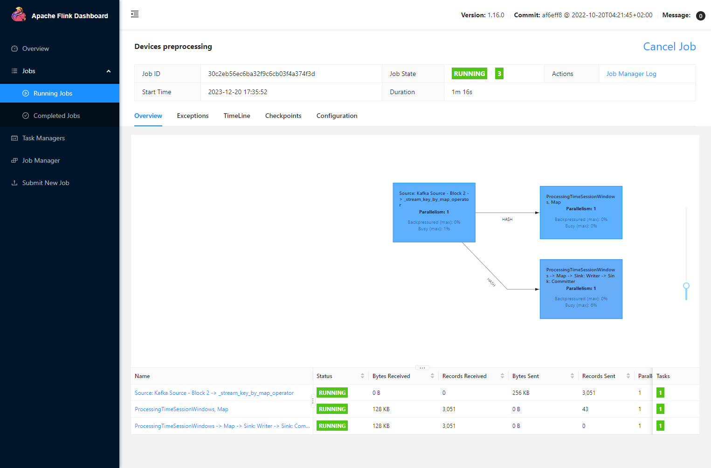

#### Переходим в директорию с docker-compose

```commandline
cd .\HW_3\kafka-flink-hdfs-docker\
```

#### Создаем топики в Kafka

```commandline
docker-compose exec kafka kafka-topics.sh --bootstrap-server kafka:9092 --create --topic block2 --partitions 3 --replication-factor 1
```

```commandline
docker-compose exec kafka kafka-topics.sh --bootstrap-server kafka:9092 --create --topic block2-processed --partitions 3 --replication-factor 1
```

#### Передаем джобу в Flink (Указать WINDOW_TYPE - "tumbling", "sliding", "session" or None)

```commandline
docker-compose exec jobmanager ./bin/flink run -py /opt/pyflink/Block_2/device_job.py -d
```

#### Запускаем producer и consumer

```commandline
cd ..\Block_2\
```

```commandline
python producer.py
```

```commandline
python consumer.py
```

#### Flink Job
